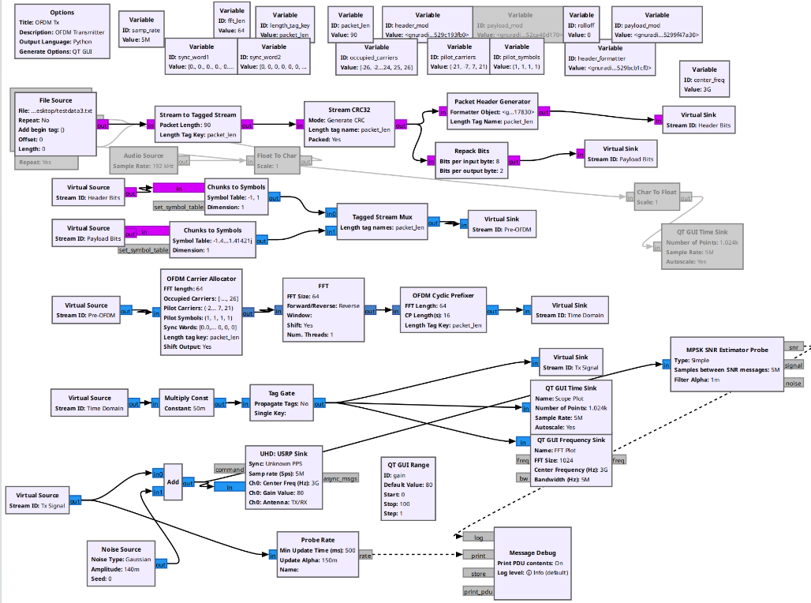
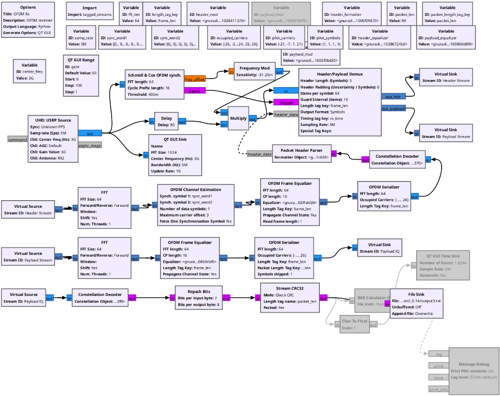
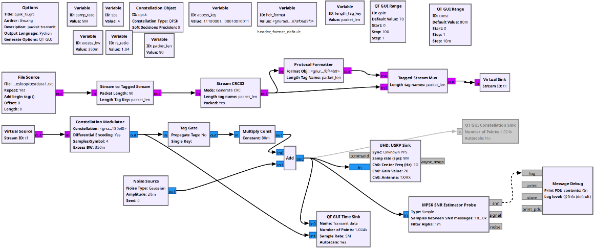
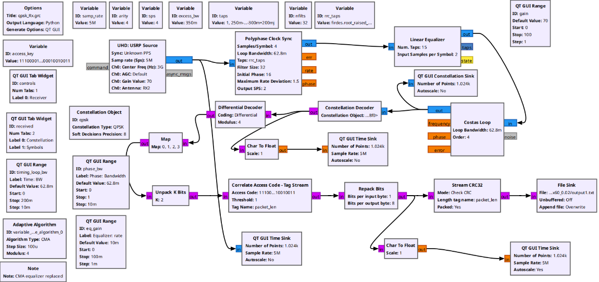

# USRP_GNURadio_OFDM
The grc file can be implemented on two USRP B210 Board

[OFDM_Tx](rx_ofdm_64.grc) and [OFDM_Rx](tx_ofdm_64.frc) are used for OFDM communication system.

[qpsk_Rx](qpsk_RX.grc) and [qpsk_Tx](qpsk_Tx.grc) are used for single carrier communication system.

A test script can be generated by MATLAB to test the performance of the communication system.

